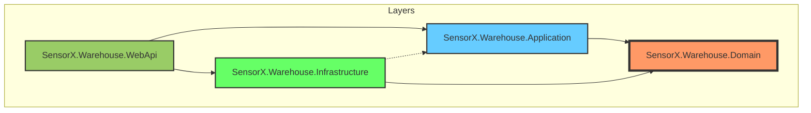

# 📦 SensorX.Warehouse

SensorX.Warehouse là một hệ thống quản lý kho (Warehouse Management System - WMS) hiện đại, tập trung vào hiệu năng, tính mở rộng và tuân thủ các nguyên tắc thiết kế phần mềm sạch (**Clean Architecture**) và phát triển dựa trên tên miền (**Domain-Driven Design - DDD**).


---

## 🏗️ Sơ đồ kiến trúc (Architecture)

Dự án được xây dựng theo mô hình **Clean Architecture**, tách biệt hoàn toàn Logic nghiệp vụ khỏi các yếu tố công nghệ (Database, Web Framework).



### 🧱 Giải thích các tầng:

1.  **SensorX.Warehouse.Domain (Lõi - Core)**:
    *   **Mục đích**: Chứa logic nghiệp vụ cốt lõi, không phụ thuộc vào bất kỳ thư viện bên ngoài nào.
    *   **Thành phần**: Aggregates, Entities, Value Objects (Code, InventoryItem, StockIn, StockOut), SeedWork, Domain Events.
    *   **Nguyên tắc**: Đây là trung tâm của ứng dụng.

2.  **SensorX.Warehouse.Application (Cầu nối)**:
    *   **Mục đích**: Triển khai các "Use Cases" của hệ thống.
    *   **Thành phần**: CQRS Pattern (Commands & Queries), DTOs, Mapping logic, Interfaces.
    *   **Nguyên tắc**: Phụ thuộc vào tầng Domain nhưng không quan tâm đến cách lưu trữ dữ liệu.

3.  **SensorX.Warehouse.Infrastructure (Hạ tầng)**:
    *   **Mục đích**: Cung cấp các công cụ thực thi kỹ thuật (Persistence, External Services).
    *   **Thành phần**: EF Core DBContext, Migrations, Repository Implementations, Caching, Logging.
    *   **Nguyên tắc**: Hiện thực hóa các interface được định nghĩa ở tầng Application.

4.  **SensorX.Warehouse.WebApi (Cung cấp API)**:
    *   **Mục đích**: Entry point của ứng dụng, xử lý các yêu cầu HTTP.
    *   **Thành phần**: Controllers / Minimal APIs, Middleware, Dependency Injection Setup, Configuration.

---

## 🚀 Hướng dẫn cài đặt (Getting Started)

### 1. 📥 Sao chép mã nguồn (Git Clone)
Mở terminal và chạy lệnh:
```bash
git clone https://github.com/SensorX-labs/SensorX.Warehouse.git
cd SensorX.Warehouse
```

### 2. 🐋 Khởi chạy Docker (Postgres & Admin)
Hệ thống sử dụng **PostgreSQL** và **pgAdmin**. Bạn có thể khởi chạy nhanh bằng Docker Compose:
```bash
docker-compose up -d
```
*   **Postgres**: Port `5432`
*   **pgAdmin**: Truy cập tại `http://localhost:8080` (Email: `admin@sensorx.com`, Pass: `admin`)

### 3. 🛠️ Chạy Migrations (Cập nhật Database)
Sau khi Database đã sẵn sàng, hãy thực thi Migration để tạo cấu trúc bảng:
```bash
# Đảm bảo bạn đang ở thư mục gốc của dự án
dotnet ef database update --context AppDbContext -p ./SensorX.Warehouse.Infrastructure/SensorX.Warehouse.Infrastructure.csproj -s ./SensorX.Warehouse.WebApi/SensorX.Warehouse.WebApi.csproj
```

### 4. ▶️ Chạy ứng dụng
```bash
cd SensorX.Warehouse.WebApi
dotnet run
```
Truy cập Swagger UI tại: `https://localhost:<port>/swagger`

---

## 🛠️ Công cụ và Công nghệ
*   **.NET 8 Core / C#**
*   **EF Core** cho PostgreSQL
*   **Domain-Driven Design (DDD)**
*   **CQRS** (Command Query Responsibility Segregation)
*   **MediatR** (cho việc tách biệt Command/Query)
*   **FluentValidation** cho Validate dữ liệu
*   **Docker & Docker Compose**

---

## 📝 Chú thích về chức năng
*   **InventoryItem**: Quản lý tồn kho cho từng sản phẩm/vật tư.
*   **StockIn/StockOut**: Quản lý quá trình nhập/xuất kho.
*   **PickingNote**: Phiếu lấy hàng để phục vụ xuất kho.
*   **Code ValueObject**: Đảm bảo tất cả các mã định danh trong hệ thống tuân thủ định dạng chuẩn.

---
*Phát triển bởi [Tùng Sk](https://github.com/sk)*
